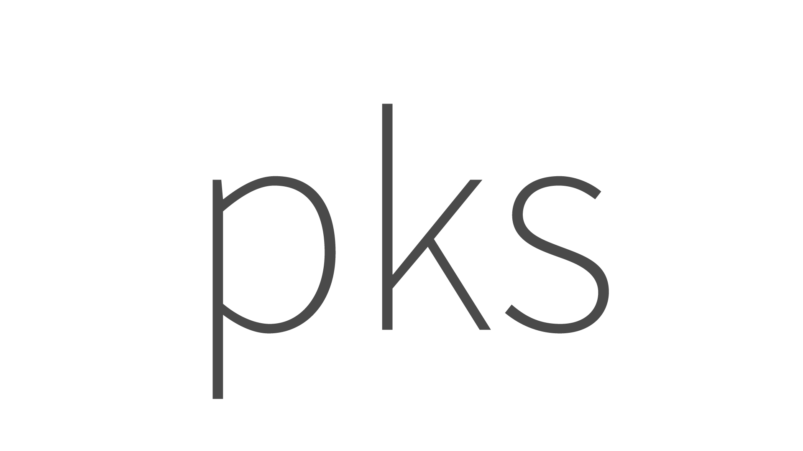

<p align="center">
  <h1>Docs</h1>
</p>

<p align="center">
  
</p>

  [English](./README.zh-CN.md) | 简体中文

  
  
  
  
  

## Install

* npm

  ```bash
  npm install pks-cli
  ```

* yarn

  ```bash
  yarn add pks-cli
  ```

## Build

```bash
# development
npm run dev

# publish
npm run build
```
## License

Copyright (c) 2017-present Alex Ceng
